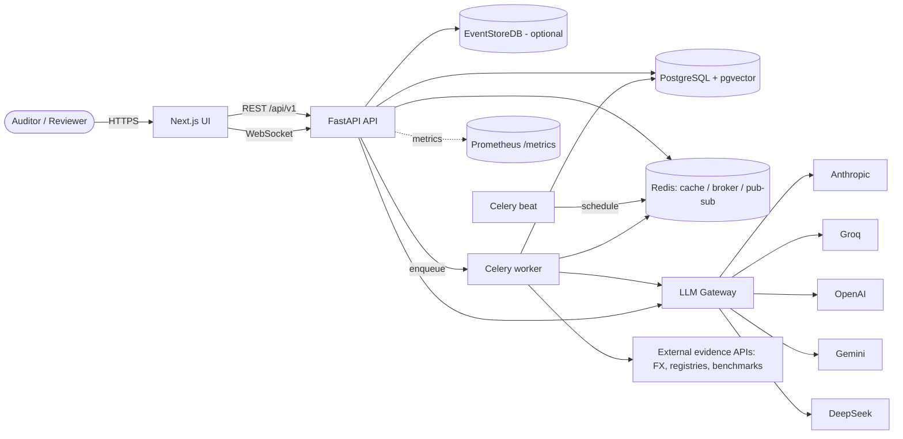
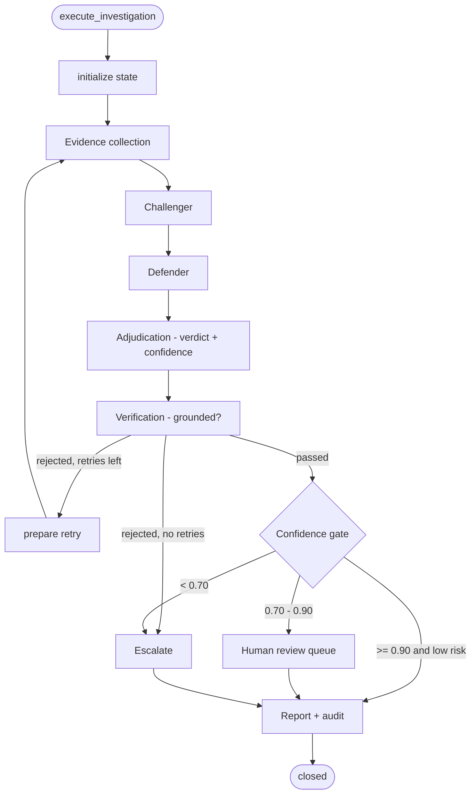
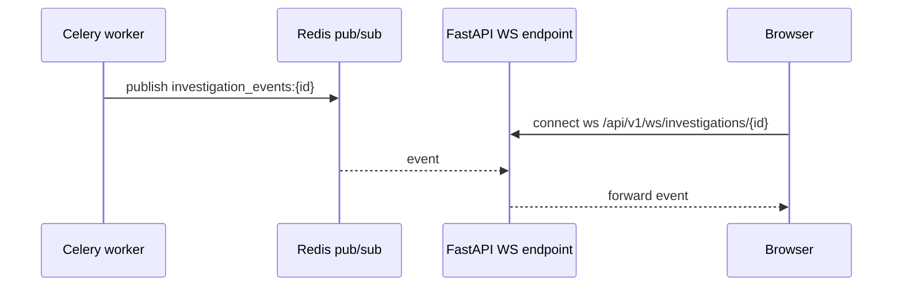
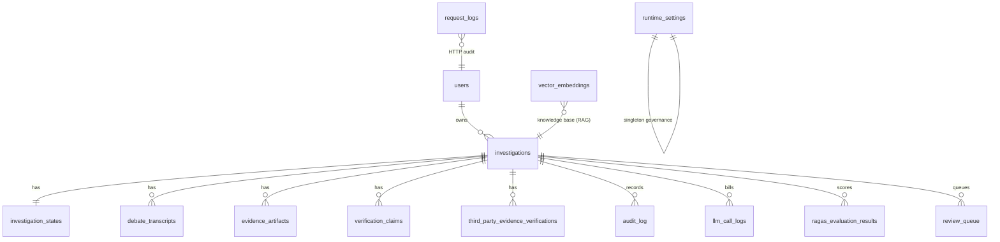
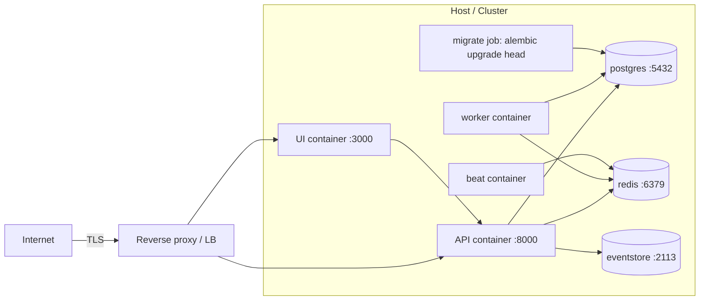

# Architecture and Data Flow

**Verified against:** `Backend/app/`, `UI/`, infra manifests. **Version:** `0.1.0`.

## 1. Overview (for all audiences)

Skeptic Engine is an audit-investigation platform. Flagged general-ledger transactions
are investigated by a crew of six specialized AI agents that run an adversarial debate
(Challenger vs. Defender), grounded in retrieved evidence and third-party checks, gated
by a confidence threshold, routed to human review when needed, and recorded to an
immutable, hash-chained audit trail.

- **Frontend:** Next.js 15 / React 19 (`UI/`), TanStack Query/Table, React Flow, Recharts.
- **Backend:** FastAPI (`Backend/app/`), SQLAlchemy 2.0, Pydantic v2.
- **Agents:** LangGraph `StateGraph` orchestrating six roles (`app/agents/`).
- **Datastores:** PostgreSQL (+ `pgvector` for RAG), Redis (cache + Celery + pub/sub),
  EventStoreDB (optional immutable audit; Postgres hash-chain fallback).
- **Async:** Celery worker + beat (optional; gated by `USE_CELERY`).
- **Observability:** Prometheus metrics at `/metrics`, optional LangSmith tracing.

## 2. System context

`USE_CELERY`, `USE_REDIS_EVENTS`, and `USE_EVENTSTORE` are feature flags. When off (the
default), investigations run in-process and audit falls back to Postgres, so a minimal
deploy needs only PostgreSQL. See [Environment Variables](ENVIRONMENT_VARIABLES.md).

## 3. The agent crew

| Agent | Role | Code |
|-------|------|------|
| Supervisor | Orchestrates the case, routes between phases | `app/agents/crew.py`, `executor.py` |
| Evidence | Collects grounded evidence (RAG + live APIs) | `executor._node_evidence` |
| Challenger | Argues the worst-case (risk) interpretation | `executor._node_challenger` |
| Defender | Argues the legitimate-business interpretation | `executor._node_defender` |
| Adjudicator | Weighs both sides into a verdict + confidence | `executor._node_adjudication` |
| Verifier | QA-gates that every claim is grounded | `executor._node_verification` |

Agents emit real Claude/LLM reasoning only when `USE_REAL_AGENTS=true`; otherwise the
executor streams deterministic stub output (`_stub_challenger`, `_stub_defender`) so the
plumbing can be developed without spending tokens.

## 4. Investigation pipeline (LangGraph state machine)

Routing is implemented in `_route_after_verification` and `_route_after_confidence_gate`.
Debate runs up to `MAX_DEBATE_ROUNDS` (default 2); verification retries up to
`MAX_VERIFICATION_RETRIES` (default 1). State is checkpointed per phase
(`_checkpoint_state`) into `investigation_states`.

## 5. Real-time updates

The worker and the API are separate processes, so in-process broadcast cannot reach
browser WebSocket clients. When `USE_REDIS_EVENTS=true`:

Code: `app/realtime/redis_bus.py` (cross-process) and `websocket_manager.py`
(same-process). With the flag off, only same-process clients receive live events.

## 6. Data model

Tables (from `app/db/models.py`, created via Alembic in `migrations/versions/`):

| Table | Purpose |
|-------|---------|
| `users` | Accounts + role (`analyst`, `reviewer`, `manager`, `partner`, `admin`) |
| `investigations` | Case header (vendor, amount, risk, confidence, status) |
| `investigation_states` | Per-phase checkpoint of the pipeline state |
| `debate_transcripts` | Challenger/Defender/Adjudicator messages |
| `evidence_artifacts` | Collected evidence + citations |
| `verification_claims` | Claim-level grounding QA |
| `third_party_evidence_verifications` | External benchmark checks (FX, flight, hotel, fuel, GST, etc.) |
| `audit_log` | Immutable hash-chained event log (Postgres fallback for EventStoreDB) |
| `request_logs` | Per-request HTTP audit |
| `llm_call_logs` | Per-call cost/latency/token telemetry |
| `ragas_evaluation_results` | Real-time RAGAS LLM-judge scores |
| `review_queue` | Human review work items |
| `vector_embeddings` | RAG knowledge chunks (pgvector column) |
| `runtime_settings` | Editable governance/model settings (singleton) |

## 7. Deployment topology (production)

Reference implementations: `docker-compose.production.yml`, `Backend/k8s-deployment.yaml`,
`Backend/railway.*.json`. See [Deployment](DEPLOYMENT.md) and [Infrastructure](INFRASTRUCTURE.md).
