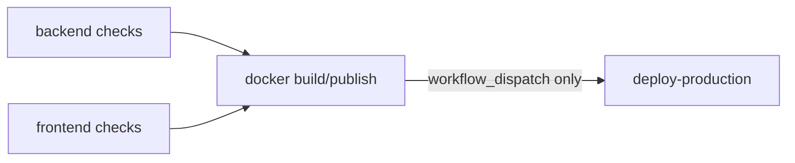

# CI/CD Guide

**Single source of truth:** `.github/workflows/ci-cd.yml`. **Version:** `0.1.0`.

## Triggers

- `pull_request` -> `main`: run checks only.
- `push` -> `main`: run checks + build/publish images to GHCR.
- `workflow_dispatch`: build/publish + deploy to the production host over SSH.

Concurrency is grouped per ref with `cancel-in-progress: true`.

## Pipeline



### Job: backend (`Backend/`)
- Python 3.11, pip cache.
- `pip install -r requirements.txt ruff==0.8.6`
- `ruff check app tests --select E,F,W --ignore E501`
- `pytest`

### Job: frontend (`UI/`)
- Node 22, Corepack (pnpm).
- `pnpm install --frozen-lockfile`
- `pnpm lint` -> `pnpm typecheck` -> `pnpm test` -> `pnpm build`

### Job: docker (push to main, not PRs)
- Builds and pushes to `ghcr.io/<owner>/<repo>-backend` and `-ui`, tagged with the commit
  SHA and `latest`, using GHA build cache.
- UI build args: `NEXT_PUBLIC_API_BASE_URL`, `NEXT_PUBLIC_API_TOKEN`,
  `NEXT_PUBLIC_API_USERNAME`, `NEXT_PUBLIC_API_PASSWORD`.

### Job: deploy-production (`workflow_dispatch` only, environment `production`)
- SSH to `PROD_HOST`, `scp` `docker-compose.production.yml` to `PROD_DEPLOY_PATH`.
- On the host: `docker login ghcr.io`, `compose pull`, `compose run --rm migrate`
  (`alembic upgrade head`), `compose up -d --remove-orphans`, using `--env-file .env.production`.

## Required GitHub configuration

**Variables:**
- `NEXT_PUBLIC_API_BASE_URL` - public API URL baked into the UI image.

**Secrets:**
- `PROD_HOST`, `PROD_USER`, `PROD_SSH_KEY` (required for deploy)
- `PROD_PORT` (default 22), `PROD_DEPLOY_PATH` (default `~/gl-guardian`)
- `GHCR_DEPLOY_USER`, `GHCR_DEPLOY_TOKEN` (optional; for private image pulls on the host)
- `NEXT_PUBLIC_API_TOKEN` / `NEXT_PUBLIC_API_USERNAME` / `NEXT_PUBLIC_API_PASSWORD` (UI build)

## Versioning and release

Images are tagged by commit SHA (immutable) plus `latest`. Roll back by re-deploying a
prior SHA tag (see [Runbook - Rollback](RUNBOOK.md#rollback-process)). Tag releases in git
per the branching strategy in [MAINTENANCE.md](MAINTENANCE.md).

## Reproducing CI locally

```bash
cd Backend && ruff check app tests --select E,F,W --ignore E501 && pytest
cd UI && pnpm install --frozen-lockfile && pnpm lint && pnpm typecheck && pnpm test && pnpm build
```
