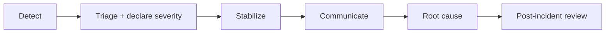

# Incident Response Guide

**Version:** `0.1.0`. Use with [Runbook](RUNBOOK.md) and [Troubleshooting](TROUBLESHOOTING.md).

## Severity levels

| Sev | Definition | Examples |
|-----|------------|----------|
| SEV1 | Outage or data loss | API down, DB unreachable, audit-chain corruption |
| SEV2 | Major degradation | Worker backlog, LLM provider outage, elevated 5xx, auth failing |
| SEV3 | Minor / single feature | One analytics panel broken, cosmetic errors |

## Process



1. **Detect** - alert fires or report received. Confirm with `/health`, `/health/detailed`,
   logs, and Prometheus.
2. **Triage** - assign severity, name an incident lead, open a channel/ticket, start a
   timeline.
3. **Stabilize** - fastest safe mitigation first (restart, scale, rollback, disable a
   feature flag). Prefer rollback to the last-good image SHA over hot-fixing under fire.
4. **Communicate** - status to stakeholders per the escalation matrix; update on a cadence.
5. **Root cause** - once stable, investigate using logs, `request_logs`, `audit_log`,
   `llm_call_logs`, and traces.
6. **Post-incident review** - blameless writeup: timeline, impact, cause, fix, and
   preventive actions -> feed into [Known Issues](KNOWN_ISSUES.md) and
   [Lessons Learned](LESSONS_LEARNED.md).

## First-response playbooks

| Symptom | Immediate action |
|---------|------------------|
| `/health` down | `logs api`; `restart api`; if config/migration bad, roll back SHA |
| `/health/detailed` 503 | DB down/unreachable - check `postgres`, connectivity, pool exhaustion |
| Worker backlog | Check `redis`; scale worker replicas/concurrency; inspect failing task in Flower |
| LLM errors | Check provider status; confirm keys; rely on `ENABLE_LLM_FALLBACK`; switch `DEFAULT_LLM_PROVIDER` |
| 401 storm after deploy | `SECRET_KEY` changed -> tokens invalid; expected, users re-login |
| Suspected breach | Rotate `SECRET_KEY` + provider keys; review `request_logs`/`audit_log`; see [Security](SECURITY.md) |

## Communication template

```
[SEVn] <short title>
Impact: <who/what is affected>
Status: investigating | mitigated | resolved
Start: <UTC>  Lead: <name>
Next update: <UTC>
```
